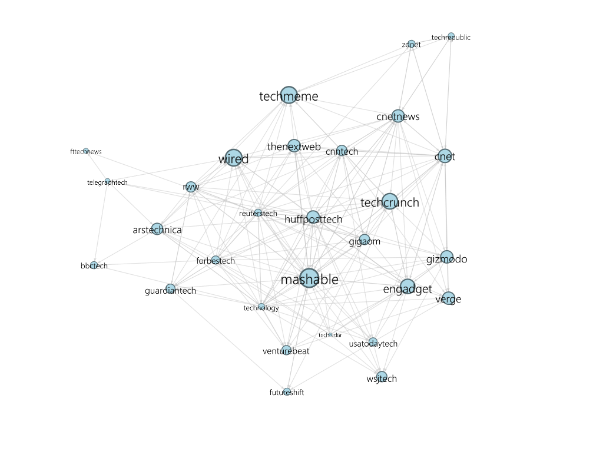
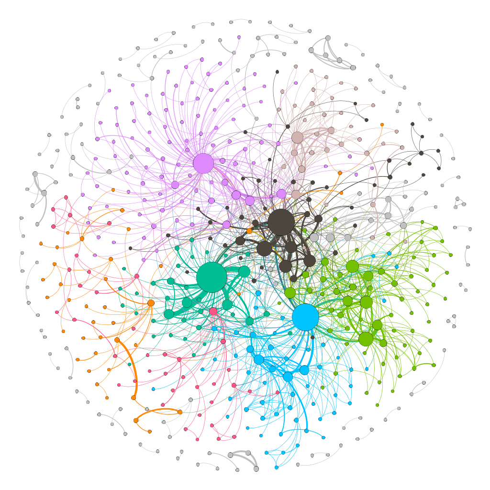

<div align="center">
  
  <h2> Data Science @ UCD </h2>
  <h4>A collection of projects from selected Data Science modules.</h4>
</div>

- [COMP30760 Data Science in Python](https://github.com/rajitbanerjee/data-science-ucd#comp30760-data-science-in-python)
  - [A1: Spotify Analysis](https://github.com/rajitbanerjee/data-science-ucd#a1-spotify-analysis)
  - [A2: COVID-19 Mobility Data Analysis](https://github.com/rajitbanerjee/data-science-ucd#a2-covid-19-mobility-data-analysis)
- [COMP30770 Programming for Big Data](https://github.com/rajitbanerjee/data-science-ucd#comp30770-programming-for-big-data)
  - [Project 1: CLI (Bash) and Data Management for Big Data](https://github.com/rajitbanerjee/data-science-ucd#project-1-cli-bash-and-data-management-for-big-data)
  - [Project 2: Spark](https://github.com/rajitbanerjee/data-science-ucd#project-2-spark)
- [COMP30850 Network Analysis](https://github.com/rajitbanerjee/data-science-ucd#comp30850-network-analysis)
  - [A1: Co-stardom Network](https://github.com/rajitbanerjee/data-science-ucd#a1-co-stardom-network)
  - [A2: Twitter Networks](https://github.com/rajitbanerjee/data-science-ucd#a2-twitter-networks)
- [COMP30390 Optimisation](https://github.com/rajitbanerjee/data-science-ucd#comp30390-optimisation)
  - [A1: Linear Programming](https://github.com/rajitbanerjee/data-science-ucd#a1-linear-programming)
  - [A2: Integer Linear Programming](https://github.com/rajitbanerjee/data-science-ucd#a2-integer-linear-programming)
- [Acknowledgements](https://github.com/rajitbanerjee/data-science-ucd#acknowledgements)

---

## COMP30760 Data Science in Python

Autumn Trimester, 2020

### Getting Started

- Create and activate the `ds-env` environment.
  ```bash
  conda env create -f environment.yml
  conda activate ds-env
  ```
- Change to the `python-comp30760` directory, then run `juypter notebook`.
- The project [notebooks](./python-comp30760/notebooks/) can now be run.

### A1: Spotify Analysis


The objective of this assignment is to collect a dataset from one or more open web APIs, and use Python to prepare, analyse, and derive insights from the collected data.

- **API chosen:** [Spotify Web API](https://developer.spotify.com/documentation/web-api/)
- **Data:** [python-comp30760/data/a1/](./python-comp30760/data/a1/) (pre-collected to avoid calling the API with secret tokens which are not included).
- **Notebook:** [a1-spotify-analysis.ipynb](./python-comp30760/notebooks/a1-spotify-analysis.ipynb)

#### Tasks:

- Data Identification and Collection:
  - Choose one or more public web APIs.
  - Collect data from your API(s) using Python.
  - Save the collected dataset in JSON format for subsequent analysis.
- Data Preparation and Analysis:
  - Load the stored JSON dataset, and represent it using an appropriate structure.
  - Apply any pre-processing steps that might be required to clean, filter or engineer the dataset before analysis.
  - Analyse, characterise, and summarise the cleaned dataset, using tables and visualisations where appropriate.
  - Summarise any insights which you gained from your analysis of the dataset, and suggest ideas for further analysis.

### A2: COVID-19 Mobility Data Analysis


Increasingly, large-scale mobility datasets are being made publicly available for research purposes. This type of data describes the aggregated movement of people across a region or an entire country over time. Mobility data can naturally be represented using a time series, where each day is a different observation. Recently, Google made mobility data available to help researchers to understand the effects of COVID-19 and associated government policies on public behaviour. This data charts movement patterns across different location categories (e.g. work, retail etc). The objective of this assignment is construct different time series representations for a number of countries based on the supplied mobility data, and analyse and compare the resulting series.

- **Data:** [python-comp30760/data/a2/](./python-comp30760/data/a2/) (three countries selected: _Ireland, New Zealand, USA_)
- **Notebook:** [a2-covid-19-mobility.ipynb](./python-comp30760/notebooks/a2-covid-19-mobility.ipynb)

#### Tasks:

<ul>
  <li>
  <details>
    <summary>Within-country analysis (for each of the three selected countries separately)</summary>
    <ul>
      <li>
        Construct a set of time series that represent the mobility patterns for the different location categories for
        the country (e.g. workplaces, residential, transit stations etc).
      </li>
      <li>
        Characterise and visualise each of these time series. You may choose to apply
        re-sampling and/or smoothing in order to provide a clearer picture of the trends
        in the series.
      </li>
      <li>
        Compare and contrast how the series for the different location categories have
        changed over time for the country. To what extent are these series correlated
        with one another?
      </li>
      <li>
        Suggest explanations for any differences that you have observed between the
        time series for the location categories.
      </li>
    </ul>
  </details>
  </li>
  <li>
    <details>
      <summary>Between-country analysis (taking the three selected countries together)</summary>
      <ul>
        <li>
          Construct a set of time series that represent the overall mobility patterns for the
          three countries.
        </li>
        <li>
          Characterise and visualise each of these time series. You may choose to apply
          re-sampling and/or smoothing in order to provide a clearer picture of the trends
          in the series.
        </li>
        <li>
          Compare and contrast how the overall time series for the three countries have
          changed over time. To what extent are these series correlated with one another?
        </li>
        <li>
          Suggest explanations for any differences that you have observed between the
          time series for the countries.
        </li>
      </ul>
    </details>
  </li>
</ul>

## COMP30770 Programming for Big Data

Spring Trimester, 2021

### Project 1: CLI (Bash) and Data Management for Big Data


For a detailed report, please see [proj1-report.pdf](./big-data-comp30770/proj1-bash-data-management/proj1-report.pdf).

#### 1. Cleaning a Dataset with Bash

The scripts below can be run on any Linux shell, without any command line arguments.  
Bash on WSL2 for Windows 10 has been used for development.

- Raw dataset: [data/reddit_2021.csv](./big-data-comp30770/proj1-bash-data-management/data/reddit_2021.csv)
- Execute permissions for scripts:
  ```
  $ chmod +x ./*.sh
  ```
- Performing data cleaning operations:
  ```
  $ ./00-replace-protected-commas.sh
  $ ./01-drop-index-and-nsfw.sh
  $ ./02-drop-empty-cols.sh
  $ ./03-drop-single-val-cols.sh
  $ ./04-sec-to-month.sh
  $ ./05-count-posts-per-month.sh
  $ ./06ab-title-lower-no-punc.sh
  $ ./06c-remove-stop-words.sh
  $ ./06d-reduce-to-stem.sh
  $ ./06e-place-clean-titles.sh
  ```
- All other files in the [data/](./big-data-comp30770/proj1-bash-data-management/data/) directory are regenerated by the scripts above.
- Clean dataset obtained: [data/reddit_2021_clean.csv](./big-data-comp30770/proj1-bash-data-management/data/reddit_2021_clean.csv)

#### 2. Data Management

A Docker container with support for MySQL and MongoDB is recommended.  
Image used: `registry.gitlab.com/roddhjav/ucd-bigdata/db`.

- Stop and remove preexisting containers named `comp30770-db`, then create a new container using the above image.
  ```
  $ ./docker-create.sh
  ```
- Copy scripts for MySQL and MongoDB, and the cleaned dataset [data/reddit_2021_clean.csv](./big-data-comp30770/proj1-bash-data-management/data/reddit_2021_clean.csv) to the container.
  ```
  $ ./docker-cp-files.sh
  ```
- Start a Bash prompt in the container's `/root` directory.
  ```
  $ ./docker-start.sh
  ```
- Create and populate the 'reddit' database in MySQL and MongoDB (in Docker)
  ```
  # ./07-mysql-create-db.sh
  # ./08-mysql-populate-db.sh
  # ./09-mongo-populate-db.sh
  ```
- Queries are run in the `mysql` and `mongo` prompts as described in the report.

#### 3. Reflection

- CLI for Big Data
- Relational (SQL) vs. non-relational (NoSQL) database systems
- Review on 'Dynamo: Amazon's highly available key-value store'

### Project 2: Spark


For a detailed report, please see [proj2-report.pdf](./big-data-comp30770/proj2-spark/proj2-report.pdf).

- Execute permissions for scripts:

  ```
  $ chmod +x ./*.sh
  ```

- Set up a Docker cluster for Spark:

  ```
  $ ./docker-setup-spark.sh
  ```

- Clean and download [data/](./big-data-comp30770/proj2-spark/data) files, copy files to Docker container, and start a Bash prompt.  
  Both files in the [data/](./big-data-comp30770/proj2-spark/data) directory are regenerated by this script.

  ```
  $ ./docker-start.sh
  ```

- In the container, run Spark SQL queries on the GitHub starred projects dataset.

  ```
  bash-5.0# spark-shell -i 01-github.scala
  ```

- Graph processing on the DBLP co-authorship dataset.

  ```
  bash-5.0# spark-shell -i 02-dblp.scala
  ```

- Reflection: Review on 'Spark: Cluster Computing with Working Sets'.

## COMP30850 Network Analysis

Spring Trimester, 2021

### A1: Co-stardom Network

The goal of this assignment is to construct and characterise network representations of two movie-related datasets. The networks should model the co-starring relations between actors in these two dataset - i.e. the collaboration network of actors who appear together in the same movies.

- **Data:** [a1-co-stardom-network/data/](./network-analysis-comp30850/a1-co-stardom-network/data/)
- **Notebook:** [a1-co-stardom-network.ipynb](./network-analysis-comp30850/a1-co-stardom-network/a1-co-stardom-network.ipynb)

  Set up `conda` environment and start Jupyter Notebook.

  ```
  $ conda create -n a1-comp30850 python=3.8 jupyterlab networkx seaborn
  $ conda activate a1-comp30850
  $ cd network-analysis-comp30850/a1-co-stardom-network/
  $ jupyter notebook
  ```

- **GEXF and PNG Files:** [net1.gexf](./network-analysis-comp30850/a1-co-stardom-network/net1.gexf), [net2.gexf](./network-analysis-comp30850/a1-co-stardom-network/net2.gexf), [net1.png](./network-analysis-comp30850/a1-co-stardom-network/net1.png), [net2.png](./network-analysis-comp30850/a1-co-stardom-network/net2.png)
- **Gephi Project:** [costardom.gephi](./network-analysis-comp30850/a1-co-stardom-network/costardom.gephi)

#### Tasks:

For each dataset:

- Network Construction
  - Parse the JSON data and create an appropriate co-starring network using [NetworkX](https://networkx.org/), where nodes represent individual actors.
  - Identify and remove any isolated nodes from the network.
- Network Characterisation
  - Apply a range of different methods to characterise the structure and connectivity of the network.
  - Apply different centrality measures to identify important nodes in the network.
- Ego-centric Analysis
  - Select one of the important nodes in the network and generate an ego network for this node.
- Network Visualisation
  - Export the network as a GEXF file and use [Gephi](https://github.com/gephi/gephi) to produce a useful visualisation.

Sample visualisations (see notebook for details):

<table>
  <tr><td>
    
  </td><td>
    
  </td></tr>
</table>

### A2: Twitter Networks


The goal of this assignment is to construct and characterise a range of network representations, created from pre-collected Twitter data for a specific Twitter List of user accounts which relate to a particular topic (e.g. technology, sports news etc).

- **Data:** [a2-twitter-networks/data/technology/](./network-analysis-comp30850/a2-twitter-networks/data/technology/)

- **Notebook:** [a2-twitter-networks.ipynb](./network-analysis-comp30850/a2-twitter-networks/a2-twitter-networks.ipynb)

  Set up `conda` environment and start Jupyter Notebook.

  ```
  $ conda create -n a2-comp30850 python=3.8 jupyterlab networkx seaborn
  $ conda activate a2-comp30850
  $ cd network-analysis-comp30850/a2-twitter-networks/
  $ jupyter notebook
  ```

- **GEXF and PNG Files:** [follow_net.gexf](./network-analysis-comp30850/a2-twitter-networks/out/follow_net.gexf), [follow_net.png](./network-analysis-comp30850/a2-twitter-networks/out/follow_net.png), [mention_net.gexf](./network-analysis-comp30850/a2-twitter-networks/out/mention_net.gexf), [mention_net.png](./network-analysis-comp30850/a2-twitter-networks/out/mention_net.png), [hashtag_co_net.gexf](./network-analysis-comp30850/a2-twitter-networks/out/hashtag_co_net.gexf), [hashtag_co_net.png](./network-analysis-comp30850/a2-twitter-networks/out/hashtag_co_net.png)
- **Gephi Project:** [twitter-networks.gephi](./network-analysis-comp30850/a2-twitter-networks/twitter-networks.gephi)

#### Tasks

For the selected data, construct and characterise five different Twitter network representations.

- Follower network
- Reply network
- Mention network
- User-hashtag network
- Hashtag co-occurrence network

Sample visualisations (see notebook for details):

<table>
  <tr><td>
    
  </td></tr>
  <tr><td>
    
  </td></tr>
</table>

## COMP30390 Optimisation

Autumn Trimester, 2021

### Getting Started

  ```bash
  cd optimisation-comp30390
  conda env create -f env-comp30390.yml
  conda activate comp30390
  jupyter notebook
  ```

A number of classic linear programming problems solved in [Julia](https://julialang.org/).

### A1: Linear Programming

- **Notebook**: [a1](./optimisation-comp30390/notebooks/a1-comp30930-18202817.ipynb)

### A2: Integer Linear Programming

- **Notebook**: [a2](./optimisation-comp30390/notebooks/a2-comp30930-18202817.ipynb)


## Acknowledgements

- [Dr Derek Greene](https://people.ucd.ie/derek.greene)
- [Dr Anthony Ventresque](https://people.ucd.ie/anthony.ventresque)
- [Thomas Laurent (TA)](https://csl.ucd.ie/index.php/thomas-laurent/)
- [Dr Deepak Ajwani](https://people.ucd.ie/deepak.ajwani)
